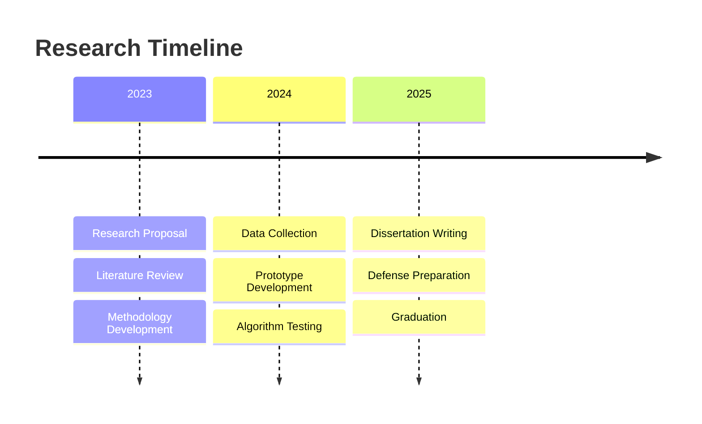

# 👋 Hi, I'm Saddiq Ur Rehman

**🎓 PhD Candidate | 🏗️ BIM & XR Researcher | 🧠 AI + AEC Innovator**  
**📍 Dept. of Architecture, Kyung Hee University, South Korea**  
**🌐 Passionate about Modular Construction, 4D BIM, Mixed Reality, and Intelligent Design Automation**

---

## 🔍 About Me

I'm a **PhD candidate** specializing in **immersive technologies** and **data-driven design** for the AEC industry. My research integrates **Building Information Modeling (BIM)** with **XR platforms**, **AI-driven tools**, and **real-time simulations** for **modular construction workflows**.

### 🎯 Research Focus:
- **4D BIM Simulation** & **Construction Scheduling**
- **Digital Twin Integration** for **DfMA** workflows  
- **Mixed Reality** in **construction inspection**
- **AI-Enhanced** design automation
- **BIM-Game Engine** interoperability

### 🏆 Current Projects:
- 🔧 **ReUniXchange** - Bidirectional BIM-Unity integration
- 🏭 **Modular Factory VR** - 4D construction simulation
- 🗣️ **Voice-Activated MR** - AI assistant for BIM inspection

---

## 🛠️ Technology Stack

### **AEC & BIM Tools**

### **XR & Development**

### **Programming & AI**

### **Data & Interoperability**

---

## 🧩 Research Projects

### 🔧 ReUniXchange – BIM ↔ Unity Integration
*Bidirectional data exchange between Revit and Unity for immersive visualization*

**Key Features:** Semantic BIM export • Real-time synchronization • Metadata preservation • XR-ready optimization

---

### 🏭 Modular Factory 4D BIM Simulation
*VR environment for construction process visualization and planning*

**Phases:** Framing → MEP → Enclosure → Finishes → QC → Delivery  
**Features:** First-person navigation • Timeline control • Interactive components

---

### 🗣️ Voice-Activated MR Assistant
*AI-powered natural language interaction with BIM components*

**Capabilities:** Component inspection • Material queries • Quality assessment • Voice commands

---

## 📊 GitHub Analytics

<table>
<tr>
<td width="50%">

</td>
<td width="50%">

</td>
</tr>
</table>

---

## 🎯 PhD Journey

### 🎓 Academic Milestones
- ✅ **Comprehensive Exam** - BIM & XR Integration
- 🔬 **Research Proposal** - AI-Enhanced Construction Workflows
- 📊 **Data Collection** - Industry Case Studies
- 📝 **Dissertation** - Expected Q3 2025

### 🚀 Research Goals
- 📦 **Open-Source Framework** - BIM-XR integration toolkit
- 🏗️ **Industry Application** - Modular construction optimization
- 🎓 **Knowledge Transfer** - Training and documentation
- 🌍 **Global Impact** - International AEC standards

---

## 🌟 Connect & Collaborate

### 🤝 Open to Collaboration
- **🏗️ BIM-XR Integration** research projects
- **🤖 AI in Construction** applications
- **📦 Modular Construction** workflows
- **🎓 Academic partnerships** and joint research

### 📧 Contact

### 🏆 Academic Status

---

**"Exploring the intersection of BIM, XR, and AI for next-generation construction workflows"**

*⭐ Star repositories that interest you!*

