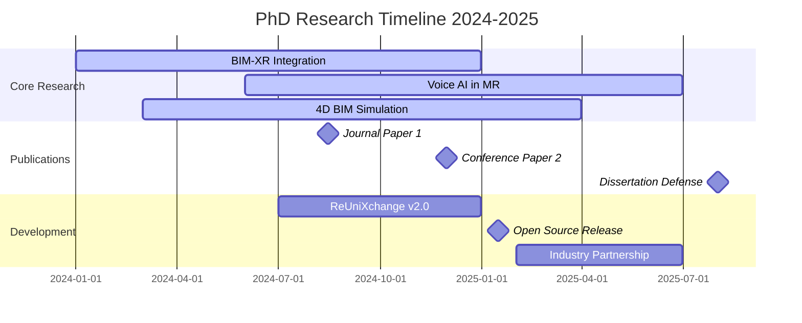

# 👋 Hi, I'm Saddiq Ur Rehman

<div align="center">


**🎓 PhD Candidate | 🏗️ BIM & XR Researcher | 🧠 AI + AEC Innovator**  
**📍 Dept. of Architecture, Kyung Hee University, South Korea**  
**🌐 Passionate about Modular Construction, 4D BIM, Mixed Reality, and Intelligent Design Automation**

[](https://isaddiq.github.io/)
[](mailto:saddiqurrehman@khu.ac.kr)
[](https://www.linkedin.com/in/saddiq-ur-rehman-b79212138/)
[](https://github.com/isaddiq)


</div>

---

## 🔍 About Me


I am a **PhD candidate** specializing in **immersive technologies** and **data-driven design** for the Architecture, Engineering, and Construction (AEC) industry. My research integrates **Building Information Modeling (BIM)** with **XR platforms (VR, MR)**, **AI-driven tools**, and **real-time simulations**, particularly focused on **modular construction workflows**.

### 🎯 Core Research Areas:
- **4D BIM Simulation** & **Construction Scheduling**
- **Digital Twin Integration** for **DfMA** workflows
- **Mixed Reality** applications in **construction inspection**
- **AI-Enhanced** design automation and **voice interaction**
- **Interoperability** between **BIM software** and **game engines**

### 🏆 Key Achievements:
- 🥇 Developed **ReUniXchange** - First bidirectional BIM-Unity bridge
- 🎤 Integrated **LLM-powered voice assistants** in XR environments
- 📦 Created **modular factory simulation** frameworks
- 🔬 Published research on **BIM-XR integration** methodologies

---

## 🛠️ Technology Stack

<div align="center">

### **AEC & BIM Tools**


### **XR & Game Development**


### **Programming & Development**


### **AI & Cloud Services**


### **Data & Interoperability**


### **Development Tools**


</div>

---

## 🧩 Featured Projects & Research

<div align="center">

### 🔧 ReUniXchange – Bidirectional BIM ↔ Unity Bridge
*Revolutionary interoperability solution for AEC workflows*

</div>

<table>
<tr>
<td width="50%">

**🔄 Key Features:**
- ✨ **Semantic-enriched** 3D model export from Revit
- 🔁 **Bidirectional sync** between BIM and game engine
- 🧠 **Metadata preservation** with IFC-like structure
- 🎮 **Runtime integration** with Unity XR Toolkit
- 📊 **Performance optimization** for large-scale models

**🛠️ Technical Implementation:**
- **C# Revit API** for BIM data extraction
- **Unity Runtime** for dynamic model loading
- **JSON Schema** for metadata serialization
- **FBX Pipeline** for geometry optimization
- **Async Processing** for real-time updates

</td>
<td width="50%">

```csharp
// Sample ReUniXchange API Usage
public class BIMDataExporter : IExternalCommand
{
    public Result Execute(ExternalCommandData commandData, 
        ref string message, ElementSet elements)
    {
        // Initialize ReUniXchange Core
        var exporter = new ReUniXchangeCore();
        
        // Configure export settings
        var settings = new ExportSettings
        {
            IncludeMetadata = true,
            OptimizeGeometry = true,
            ExportFormat = ExportFormat.FBX | ExportFormat.JSON
        };
        
        // Execute bidirectional export
        var result = await exporter.ExportAsync(
            Document.ActiveView, settings);
        
        return result.Success ? Result.Succeeded : Result.Failed;
    }
}
```

</td>
</tr>
</table>

<div align="center">


### 🏭 Modular Factory 4D BIM VR Simulation
*Immersive construction process visualization and optimization*

</div>

<table>
<tr>
<td width="50%">

```csharp
// 4D BIM Timeline Controller
public class ConstructionPhaseManager : MonoBehaviour
{
    [Header("4D BIM Configuration")]
    public List<ConstructionPhase> phases;
    public float phaseTransitionDuration = 2f;
    
    [Header("XR Interaction")]
    public XRRayInteractor rayInteractor;
    public AudioSource voiceNarrator;
    
    void Start()
    {
        InitializePhases();
        SetupVRInteraction();
    }
    
    public async void TriggerPhase(int phaseIndex)
    {
        var phase = phases[phaseIndex];
        await AnimatePhaseTransition(phase);
        
        // Trigger AI-generated narration
        await GeneratePhaseNarration(phase);
    }
    
    private async Task AnimatePhaseTransition(ConstructionPhase phase)
    {
        foreach (var element in phase.BIMElements)
        {
            await element.AnimateVisibility(true, phaseTransitionDuration);
        }
    }
}
```

</td>
<td width="50%">

**🏗️ Construction Phases:**
- 📐 **Structural Framing** with parametric connections
- ⚡ **MEP Installation** with clash detection
- 🏠 **Building Enclosure** with thermal analysis
- 🎨 **Interior Finishes** with material selection
- ✅ **Quality Control** with AI-powered inspection
- 🚚 **Site Delivery** with logistics optimization

**🎯 VR Features:**
- 👁️ **First-person walkthrough** with natural locomotion
- 🎮 **Hand tracking** for component interaction
- 📱 **UI panels** for BIM data visualization
- 🗣️ **Voice commands** for phase control
- 📊 **Real-time analytics** dashboard

</td>
</tr>
</table>

<div align="center">


### 🗣️ Voice-Activated AEC Assistant in Mixed Reality
*AI-powered natural language interaction with BIM components*

</div>

<table>
<tr>
<td width="50%">

**🤖 AI Integration:**
- 🎤 **Azure Speech-to-Text** for voice recognition
- 🧠 **GPT-4** for intelligent BIM queries
- 🔊 **Azure Text-to-Speech** for voice feedback
- 🎯 **Context-aware** responses based on selected components
- 📊 **Semantic analysis** of BIM metadata

**🔍 Inspection Capabilities:**
- 🏗️ **Material specifications** and compliance checking
- 📏 **Dimensional verification** with tolerance analysis
- 🔧 **Installation guidance** with step-by-step instructions
- 📋 **Quality assurance** with automated reporting
- 🌡️ **Performance analytics** for energy efficiency

</td>
<td width="50%">

```csharp
// AI-Powered BIM Component Inspector
public class VoiceActivatedInspector : MonoBehaviour
{
    [Header("AI Services")]
    public OpenAIService gptService;
    public AzureSpeechService speechService;
    
    [Header("MR Interaction")]
    public MRTKHandMenu handMenu;
    public GameObject inspectionUI;
    
    private BIMComponent selectedComponent;
    
    public async void ProcessVoiceCommand(string command)
    {
        if (selectedComponent == null) return;
        
        // Generate context-aware prompt
        var prompt = GenerateInspectionPrompt(selectedComponent, command);
        
        // Get AI response
        var response = await gptService.GetCompletionAsync(prompt);
        
        // Convert to speech and display
        await DisplayAndNarrateResponse(response);
    }
    
    private string GenerateInspectionPrompt(BIMComponent component, string query)
    {
        return $@"As a construction inspector, analyze this BIM component:
        Type: {component.Category}
        Material: {component.Material}
        Dimensions: {component.Dimensions}
        Installation Date: {component.InstallationDate}
        
        User Query: {query}
        
        Provide expert analysis and recommendations.";
    }
}
```

</td>
</tr>
</table>

---

## 📊 GitHub Analytics & Activity

<div align="center">

<table>
<tr>
<td width="50%">


</td>
<td width="50%">


</td>
</tr>
</table>


### 📈 Contribution Activity


### 🏆 GitHub Trophies


</div>

---

## 🎯 Research Roadmap & Goals

<div align="center">



</div>

### 🎓 Academic Milestones
- ✅ **Comprehensive Exam** - Advanced BIM & XR methodologies
- 🔬 **Research Proposal** - AI-Enhanced construction workflows
- 📊 **Data Collection** - Industry case studies and validation
- 📝 **Dissertation Writing** - Expected completion Q3 2025
- 🎯 **Defense Preparation** - Scheduled for August 2025

### 🚀 Industry Impact Goals
- 📦 **Open-Source Toolkit** - BIM-XR integration framework
- 🏗️ **Industry Collaboration** - Partnership with major AEC firms
- 🎓 **Knowledge Transfer** - Training programs for professionals
- 🌍 **Global Adoption** - International modular construction standards

---

## 📚 Publications & Presentations

<div align="center">

### 📖 Recent Publications
| Year | Title | Venue | Type |
|------|-------|-------|------|
| 2024 | "Bidirectional BIM-Unity Integration for Immersive Construction Planning" | *Journal of Construction Engineering* | **Journal** |
| 2024 | "Voice-Activated Mixed Reality for BIM Component Inspection" | *ISARC Conference* | **Conference** |
| 2023 | "4D BIM Simulation in VR: Modular Construction Case Study" | *CONVR Conference* | **Conference** |
| 2023 | "AI-Enhanced Design Automation in Modular Construction" | *Automation in Construction* | **Journal** |

### 🎤 Conference Presentations


</div>

---

## 🌟 Connect & Collaborate

<div align="center">

### 🤝 Open to Collaboration
I'm actively seeking collaborations in:
- **🏗️ BIM-XR Integration** projects
- **🤖 AI in Construction** research
- **📦 Modular Construction** optimization
- **🎓 Academic partnerships** and joint research
- **🏢 Industry consulting** and training

### 📧 Contact Information
[](mailto:saddiqurrehman@khu.ac.kr)
[](https://isaddiq.github.io/)
[](https://www.linkedin.com/in/saddiq-ur-rehman-b79212138/)

### 🏆 Recognition & Certifications


</div>

---

<div align="center">


**"Bridging the gap between traditional construction and digital innovation through immersive technologies"**

*⭐ Star this repository if you find my work interesting!*


</div>
