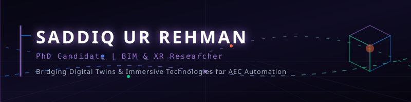
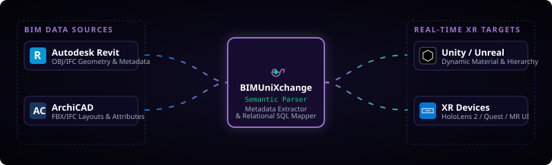

<!-- Header Banner -->
<div align="center">
  
</div>

<br/>

<!-- Social Badges -->
<div align="center">

[](https://isaddiq.github.io/)
[](mailto:saddiqurrehman@khu.ac.kr)
[](https://www.linkedin.com/in/saddiq-ur-rehman-b79212138/)

</div>

<div align="center">


</div>

---

## 🧑‍🔬 About Me


I am a **PhD Candidate** at the **Department of Architecture, Kyung Hee University, South Korea**, specializing in the intersection of **Building Information Modeling (BIM)**, **Extended Reality (XR)**, and **AI-driven design automation** for the AEC industry.

My research focuses on creating **interoperable digital workflows** that bridge the gap between BIM authoring platforms and immersive real-time environments — enabling smarter, more connected, and highly automated construction processes.

*   **📍 Location:** Seoul, South Korea
*   **🎓 Degree:** PhD in Architecture (Expected Q3 2026)
*   **🔬 Laboratory:** [Information Technology in Architecture Lab (Italab)](http://italab.khu.ac.kr/)

<br clear="right"/>

---

## 🎯 Research Focus & Pillars

Here is a visual map of my PhD research focus areas orbiting our core digital twin and design automation systems:

<div align="center">
  
</div>

### 🔬 Core Research Domains
*   **BIM–XR Integration:** Establishing cross-platform pipelines and semantic data exchange mechanisms.
*   **4D BIM Simulation:** VR-based construction scheduling, workflow planning, and prefabrication assemblies.
*   **Digital Twins:** Creating frameworks for Design for Manufacture and Assembly (DfMA) tracking.
*   **Mixed Reality (MR):** Developing voice-assisted headsets (HoloLens 2) for construction inspection and QC.
*   **AI Design Automation:** Implementing machine learning/LLM agents for design queries and layout automation.

---

## 🧩 Featured Projects

Click on the tabs below to expand and explore my primary research projects and pipelines.

<details>
<summary><b>🔧 Project 1: BIMUniXchange — Cross-Platform Semantic Exchange</b></summary>
<br/>

> *A semantic data exchange framework enabling interoperable BIM-to-XR pipelines across Autodesk Revit, Graphisoft ArchiCAD, and real-time game engines.*

### Pipeline Architecture
Here is how BIMUniXchange extracts structural properties and maps them directly into Unity/Unreal coordinates:

<div align="center">
  
</div>

### ⚙️ Key Technical Features
*   **📦 Semantic Export:** Extracts IFC metadata, material databases, and structural element hierarchies.
*   **🔗 Multi-Platform Support:** Fully supports Revit (OBJ geometry exporter) and ArchiCAD (FBX layout exporter).
*   **🔁 Relational SQLite Mapper:** Bridges element IDs bidirectionally, maintaining data integrity during round-tripping.
*   **🥽 Real-time Optimization:** Automatically optimizes geometry meshes for real-time mobile/standalone VR rendering.

</details>

<details>
<summary><b>🏭 Project 2: Modular Factory 4D BIM Simulation</b></summary>
<br/>

> *Immersive Virtual Reality environment for planning, simulating, and reviewing modular construction factory workflows.*

### 🛠️ Production Sequence Sim
Our system allows engineers to visualize and scrub through the factory floor timeline across 6 key phases:

```
[ Framing ] ──> [ MEP Rough-In ] ──> [ Enclosure ] ──> [ Finishes ] ──> [ Quality Control ] ──> [ Delivery ]
```

### 🎮 Features
*   **First-Person Navigation:** Teleportation and physics-based collision in VR.
*   **Interactive BIM Components:** Pick up, inspect, and snap modular wall/ceiling units.
*   **Timeline Scrubbing:** Slide through the construction schedule in real-time.
*   **Progress Dashboard:** Web-linked metrics showing material availability and assembly completion rates.

</details>

<details>
<summary><b>🗣️ Project 3: Voice-Activated MR Inspection Assistant</b></summary>
<br/>

> *AI-powered natural language interface overlaid on BIM components via HoloLens 2, powered by OpenAI & Azure Speech.*

### 🎙️ Immersive User Interface
*   **Hands-free Voice Commands:** Query any BIM element on-site ("*What is the structural rating of this beam?*").
*   **Visual Highlights:** Overlays colored highlights directly on structural components representing inspection status (Green: Checked, Orange: Warning, Red: Error).
*   **Real-time Logging:** Transcribes inspectorial voice notes and updates the central SQLite BIM database automatically via web APIs.

</details>

---

## 🛠️ Technology Stack

<table width="100%">
  <tr>
    <td width="50%" valign="top">
      <h4>🏛️ AEC & BIM Platforms</h4>
      
      
      
      
      
    </td>
    <td width="50%" valign="top">
      <h4>🥽 XR & Game Engines</h4>
      
      
      
      
      
      
    </td>
  </tr>
  <tr>
    <td width="50%" valign="top">
      <h4>💻 Programming & AI APIs</h4>
      
      
      
      
      
    </td>
    <td width="50%" valign="top">
      <h4>🔄 Data & Interoperability</h4>
      
      
      
      
      
    </td>
  </tr>
</table>

---

## 📊 GitHub Analytics

<div align="center">

<!-- Summary cards grid -->
<table border="0" cellpadding="0" cellspacing="0">
  <tr>
    <td colspan="3" align="center">
      
    </td>
  </tr>
  <tr>
    <td width="33%" align="center">
      
    </td>
    <td width="33%" align="center">
      
    </td>
    <td width="33%" align="center">
      
    </td>
  </tr>
</table>

</div>

---

## 🌟 Let's Collaborate

I'm always open to connecting and collaborating with researchers, developers, and industry leaders working on:
*   **🏗️ BIM–XR Integration** (workflows, schemas, geometry pipelines)
*   **🤖 AI in Construction** (automatic design reviews, agentic AEC systems)
*   **📦 Modular / DfMA** (prefabricated structural planning, sensor integrations)
*   **🎓 Academic Research** (paper writing, research grants)

<div align="center">

[](mailto:saddiqurrehman@khu.ac.kr)
[](https://isaddiq.github.io/)
[](https://www.linkedin.com/in/saddiq-ur-rehman-b79212138/)

<br/>


</div>

---

<div align="center">

*"The future of construction lies at the intersection of physical precision and digital intelligence."*


</div>
