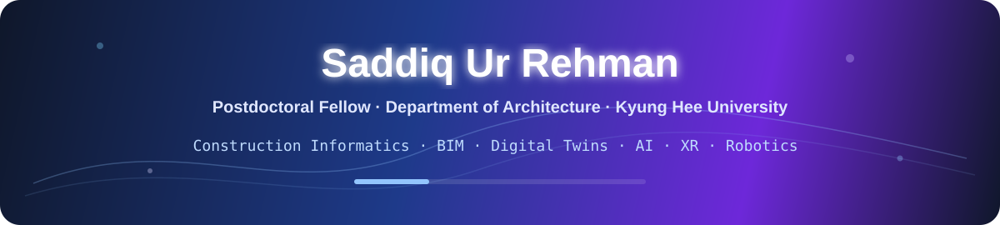
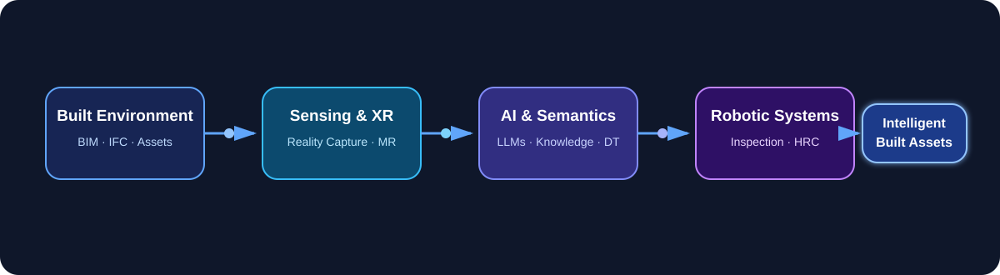

<!-- ══════════════════ ANIMATED HEADER ══════════════════ -->

<p align="center">
  
</p>

<p align="center">
  
  
</p>

<!-- ══════════════════ ABOUT ══════════════════ -->

## 🧑‍🔬 About Me


I am a **Postdoctoral Fellow** in the **Department of Architecture, Kyung Hee University, South Korea**, working in the field of **Construction Informatics** at the intersection of **Building Information Modeling (BIM), Digital Twins, Extended Reality (XR), Artificial Intelligence, and Robotics**.

My research focuses on developing **semantically connected and intelligent digital environments** that bridge building information, physical assets, humans, and autonomous systems throughout the building lifecycle.

A central theme of my work is improving interoperability between BIM, real-time environments, AI systems, and robotic platforms. This includes semantic BIM-to-XR workflows, trustworthy AI-assisted inspection, LLM-grounded BIM interaction, robot-ready building information, human-robot collaboration, and digital twin systems for construction and built-asset monitoring.

```yaml
location:   South Korea
position:   Postdoctoral Fellow
department: Department of Architecture, Kyung Hee University
degree:     PhD in Architecture
field:      Construction Informatics

research:
  - semantic BIM and openBIM
  - semantic digital twins
  - BIM-to-XR interoperability
  - AI and LLMs for AEC
  - construction robotics
  - human-robot collaboration
  - robotic inspection
  - reality capture
  - robot-friendly buildings
  - modular construction and DfMA
```

<br clear="right"/>

<!-- ══════════════════ RESEARCH OVERVIEW ══════════════════ -->

## 🎯 Research Focus

<p align="center">
  
</p>

<table width="100%">
  <tr>
    <td width="50%" valign="top">
      <h4>🔗 Semantic BIM & Interoperability</h4>
      Semantic information exchange across BIM authoring tools, openBIM / IFC, databases, digital twins, real-time engines, AI systems, and robotic platforms.
    </td>
    <td width="50%" valign="top">
      <h4>🌐 Semantic Digital Twins</h4>
      Digital twin architectures that connect physical assets, BIM elements, inspection evidence, sensor information, provenance, reliability, and decision histories.
    </td>
  </tr>
  <tr>
    <td width="50%" valign="top">
      <h4>🥽 BIM–XR & Immersive Environments</h4>
      BIM-to-XR pipelines for virtual and mixed reality applications supporting construction planning, inspection, information access, collaboration, and asset management.
    </td>
    <td width="50%" valign="top">
      <h4>🤖 AI & LLMs for the Built Environment</h4>
      Grounded large language models, conversational BIM interfaces, agentic AI, automated design review, requirements interpretation, and AI-assisted decision support.
    </td>
  </tr>
  <tr>
    <td width="50%" valign="top">
      <h4>🦾 Construction Robotics</h4>
      Integration of BIM, digital twins, autonomous robots, sensing systems, and simulation environments for construction, inspection, and built-asset operations.
    </td>
    <td width="50%" valign="top">
      <h4>👷 Human–Robot Collaboration</h4>
      Human and robot coordination in shared built environments, including workflow planning, shared infrastructure, robot navigation, vertical transportation, and operational efficiency.
    </td>
  </tr>
  <tr>
    <td width="50%" valign="top">
      <h4>📡 Reality Capture & Intelligent Inspection</h4>
      Integration of RGB imagery, point clouds, computer vision, multimodal sensing, BIM, and AI for automated inspection, progress monitoring, defect assessment, and evidence-based decision making.
    </td>
    <td width="50%" valign="top">
      <h4>🏢 Robot-Friendly Building Design</h4>
      Building information and design strategies that improve robot accessibility, navigation, task execution, information exchange, and long-term human-robot coexistence.
    </td>
  </tr>
  <tr>
    <td width="50%" valign="top">
      <h4>🏭 DfMA & Modular Construction</h4>
      Digital methods for Design for Manufacture and Assembly, modular construction planning, prefabrication, production simulation, inspection, and lifecycle information integration.
    </td>
    <td width="50%" valign="top">
      <h4>🕓 4D BIM & Construction Simulation</h4>
      BIM-based construction sequencing, workflow simulation, virtual environments, productivity analysis, and operational scenario evaluation.
    </td>
  </tr>
</table>

<!-- ══════════════════ RESEARCH FLOW ══════════════════ -->

## 🧭 Research Direction

<p align="center">
  
</p>

<!-- ══════════════════ TECHNOLOGY STACK ══════════════════ -->

## 🛠️ Technology Stack

<p align="center"><b>Programming & Development</b></p>

<p align="center">
  
</p>

<br/>

<p align="center"><b>AEC, XR & AI Platforms</b></p>

<p align="center">
  
  
  
  
  
</p>

<br/>

<p align="center"><b>Primary Research Domains</b></p>

<p align="center">
  
  
  
  
</p>

<!-- ══════════════════ GITHUB ANALYTICS ══════════════════ -->

## 📊 GitHub Analytics

<p align="center">
  
  
</p>

<p align="center">
  
</p>

## 🏆 GitHub Trophies

<p align="center">
  
</p>

<!-- ══════════════════ COLLABORATION ══════════════════ -->

## 🌟 Research & Collaboration

I am interested in research collaborations across academia and industry in areas including:

- 🏗️ **Construction Informatics**: BIM, openBIM, semantic interoperability, and lifecycle information management
- 🌐 **Digital Twins**: semantic digital twins, built-asset monitoring, inspection evidence, and decision support
- 🥽 **BIM–XR Integration**: immersive construction environments, mixed reality inspection, and BIM-to-XR workflows
- 🤖 **AI for AEC**: LLM-grounded BIM systems, agentic AI, automated design review, and intelligent decision support
- 🦾 **Construction Robotics**: BIM-robot integration, robotic inspection, navigation, and robot-ready information
- 👷 **Human–Robot Collaboration**: shared infrastructure, operational simulation, vertical transport, and collaborative workflows
- 📡 **Reality Capture**: point clouds, computer vision, multimodal sensing, and BIM-linked inspection
- 📦 **Modular Construction & DfMA**: prefabrication, production simulation, digital inspection, and information integration

<br/>

<p align="center">
  <a href="https://github.com/isaddiq"></a>
  <a href="mailto:saddiq.r.97@gmail.com"></a>
  <a href="https://www.khu.ac.kr/"></a>
</p>

<!-- ══════════════════ FOOTER ══════════════════ -->

<p align="center">
  
</p>
