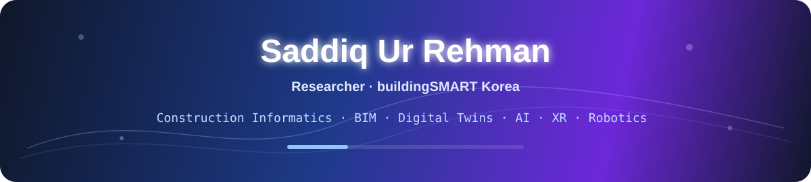
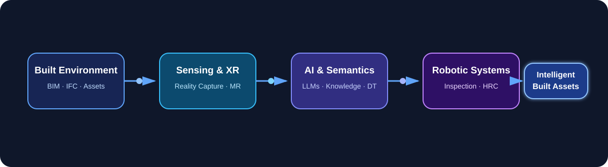

<!-- ══════════════════ ANIMATED HEADER ══════════════════ -->

  

  
  

<!-- ══════════════════ PROFILE_1 (ASCII PORTRAIT + ABOUT) ══════════════════ -->

  

<!-- ══════════════════ ABOUT ══════════════════ -->

## 🧑‍🔬 About Me

Buildings carry an enormous amount of information, yet most of it stays locked inside the software that created it. I want that information to **keep its meaning wherever it goes**: into a headset on site, a conversation with an AI assistant, an inspection report, or the navigation map of a robot.

My work links building information, physical assets, people, and autonomous systems into **digital environments that stay useful across a building's whole life**, from design and construction through inspection and day-to-day operation.

 

<!-- ══════════════════ RESEARCH QUESTIONS ══════════════════ -->

## 🎯 Research Questions

The questions that drive my work, from the data inside a model to the robots moving through a building:

<table width="100%">
  <tr>
    <td width="50%" valign="top">
      <h4>🔗 Information that travels</h4>
      How can building information move between authoring tools, databases, real-time engines, AI and robots <b>without losing its meaning</b>?
    </td>
    <td width="50%" valign="top">
      <h4>🌐 Twins that remember</h4>
      How should a digital twin record not only what a building is, but <b>where its evidence came from, how reliable it is</b>, and which decisions it informed?
    </td>
  </tr>
  <tr>
    <td width="50%" valign="top">
      <h4>🥽 Information in place</h4>
      How can the right building information appear <b>in front of the right person, on site</b>, for planning, inspection and asset management?
    </td>
    <td width="50%" valign="top">
      <h4>🧠 AI you can trust</h4>
      How can language models answer questions about a building and review designs <b>grounded in the model</b>, rather than guessing?
    </td>
  </tr>
  <tr>
    <td width="50%" valign="top">
      <h4>🦾 Buildings robots can read</h4>
      What does a robot need from building information to <b>navigate, inspect and work autonomously</b> during construction and operation?
    </td>
    <td width="50%" valign="top">
      <h4>👷 Sharing the building</h4>
      How can people and robots share <b>corridors, lifts and workflows</b> in the same building without slowing each other down?
    </td>
  </tr>
  <tr>
    <td width="50%" valign="top">
      <h4>📡 Evidence from reality</h4>
      How can images, point clouds and sensor data become <b>inspection evidence tied to the right building element</b>?
    </td>
    <td width="50%" valign="top">
      <h4>🏢 Designing for robots</h4>
      How should buildings be designed today so that <b>people and robots can coexist in them</b> for decades to come?
    </td>
  </tr>
  <tr>
    <td width="50%" valign="top">
      <h4>🏭 Built in the factory</h4>
      How can digital methods make modules <b>easier to plan, produce, inspect and track</b> across their whole lifecycle?
    </td>
    <td width="50%" valign="top">
      <h4>🕓 Rehearsing construction</h4>
      How can simulation <b>test sequences and operational scenarios</b> before they happen on site?
    </td>
  </tr>
</table>

<!-- ══════════════════ RESEARCH FLOW ══════════════════ -->

## 🧭 Research Direction

  

<!-- ══════════════════ GITHUB ANALYTICS ══════════════════ -->

## 📊 GitHub Analytics

  
  

  

## 🏆 GitHub Trophies

  

<!-- ══════════════════ COLLABORATION ══════════════════ -->

## 🤝 Let's Collaborate

If any of the questions above overlap with your work, in academia or industry, I'd be glad to hear from you: joint research, pilot projects, or simply an exchange of ideas.

  

<!-- ══════════════════ FOOTER ══════════════════ -->

  

